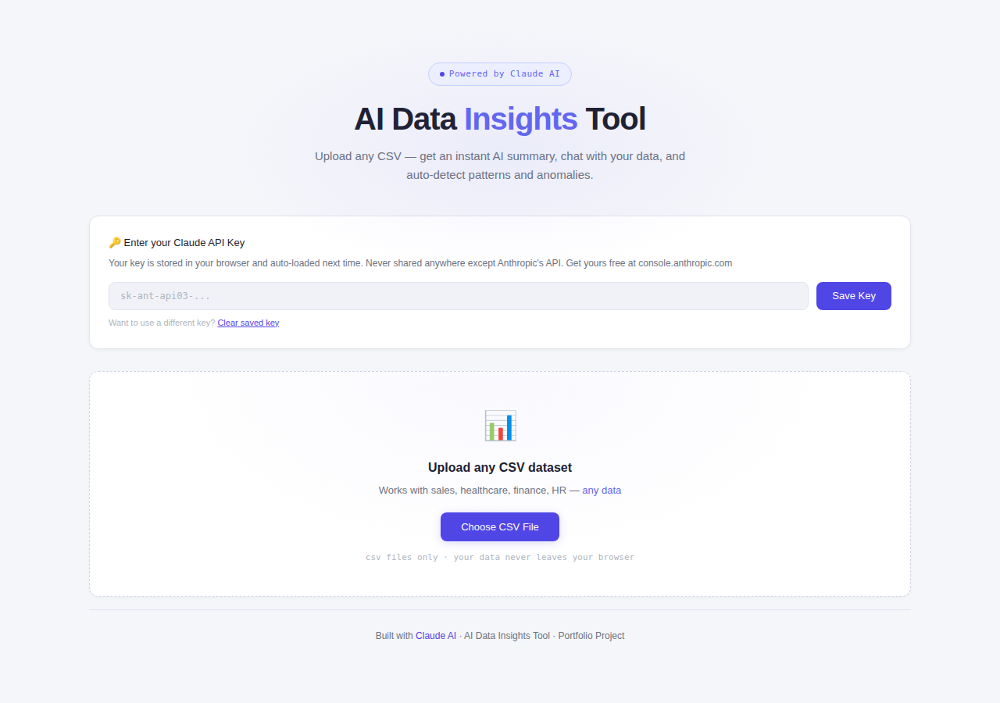
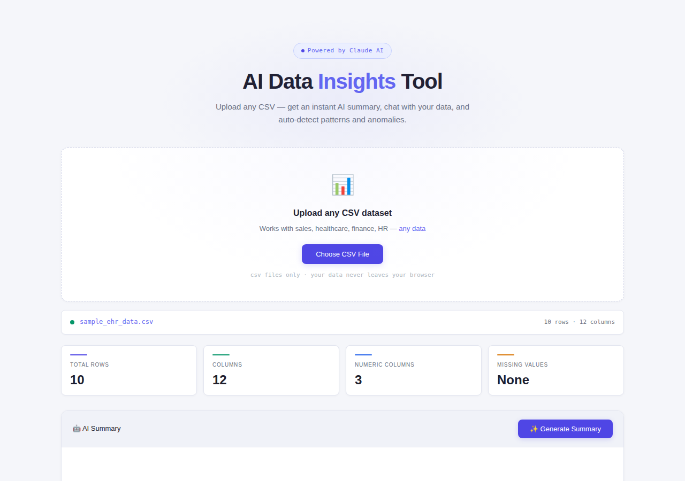
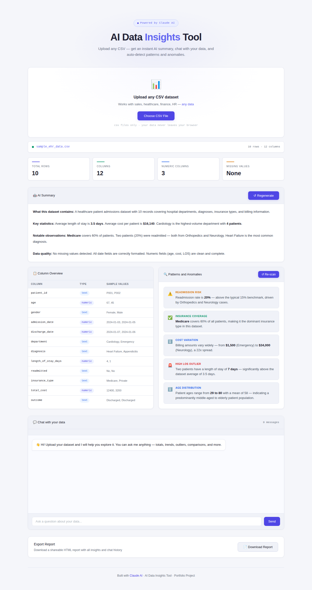
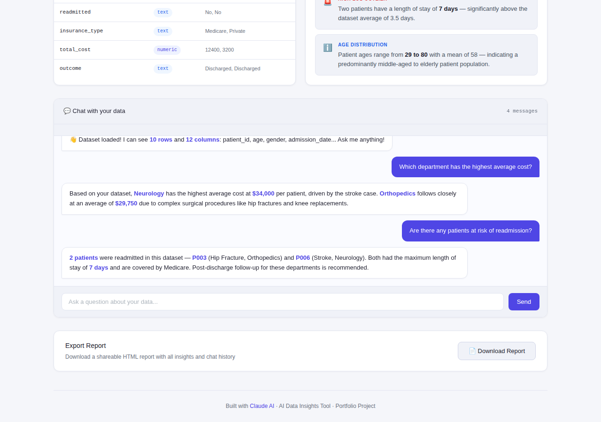

# 🤖 AI Data Insights Tool

An AI-powered data analysis tool that lets you upload **any CSV file** and instantly get an AI-written summary, chat with your data in plain English, auto-detect patterns and anomalies, and export a shareable report — all in a single HTML file with no installation required.

**Built with:** HTML · CSS · JavaScript · Claude AI API

---

## 📸 Screenshots

**1. Upload Screen — works with any CSV dataset**

**2. Dashboard Overview — instant KPIs and column detection**

**3. AI Summary and Pattern Detection**

**4. Chat with Your Data in Plain English**

---

## ✨ Features

- **Universal CSV Upload** — works with any dataset: healthcare, sales, finance, HR, marketing, and more
- **AI-Written Summary** — Claude reads your data and writes a plain-English overview covering key statistics, trends, and data quality
- **Chat with Your Data** — ask questions like "Which category has the highest total?" or "Are there any outliers?" and get precise answers referencing your actual data
- **Auto Pattern & Anomaly Detection** — AI scans your dataset and flags 5 key findings including anomalies, correlations, and trends
- **Column Intelligence** — automatically detects whether each column is numeric, text, or date
- **Exportable Report** — one-click download of a shareable HTML report containing all insights, patterns, and chat history
- **Remembers Your API Key** — saves your key locally in the browser so you never have to re-enter it
- **Fully Responsive** — works on desktop, tablet, and mobile

---

## 🧠 AI & Prompting Techniques

This project demonstrates 6 real-world AI prompt engineering techniques:

| Technique | How It Is Used |
|---|---|
| **Role Prompting** | Claude is given the persona of a senior data analyst with 10 years of experience |
| **Chain of Thought** | Claude reasons step by step before writing output — understand → identify → calculate → summarize |
| **Constraint Prompting** | Claude is told never to invent statistics — only reference numbers that exist in the uploaded data |
| **Structured Output** | Every AI summary follows a fixed format: What it contains → Key statistics → Notable observations → Data quality |
| **Few-Shot Prompting** | The chat feature includes example Q&A pairs to set the standard for detailed answers |
| **Context Injection** | The full dataset sample is injected into every API call so Claude always has the real data in front of it |

---

## 🚀 How to Use

1. Download `ai-data-insights-tool.html`
2. Open it in any browser (Chrome, Safari, Firefox)
3. Enter your Claude API key from [console.anthropic.com](https://console.anthropic.com) — it is saved automatically for next time
4. Upload any CSV file
5. Click **"✨ Generate Summary"** for an AI-written overview
6. Click **"Detect Patterns"** to auto-find anomalies and trends
7. Type any question in the chat box to talk to your data
8. Click **"Download Report"** to export everything as a shareable file

> **No installation. No server. No frameworks. Just one HTML file.**

---

## 🔑 API Key Setup

1. Go to [console.anthropic.com](https://console.anthropic.com) and create a free account
2. Click **"API Keys"** → **"Create Key"**
3. Copy the key and paste it into the tool when prompted
4. The key is saved in your browser — you only need to do this once

> Your API key is stored only in your browser's local storage. It is never sent anywhere except directly to Anthropic's API.

---

## 💡 Example Questions You Can Ask

- "What is the average value in column X?"
- "Which category appears most frequently?"
- "Are there any outliers or unusual values?"
- "What is the trend over time?"
- "Which row has the highest total cost?"
- "How many missing values are there?"

---

## 📈 What This Demonstrates (For Recruiters)

- ✅ Data ingestion and CSV parsing
- ✅ Automatic column type detection
- ✅ AI prompt engineering (6 techniques)
- ✅ Natural language interface for data querying
- ✅ Pattern recognition and anomaly flagging
- ✅ Translating raw data into business insights
- ✅ Report generation and export
- ✅ Building tools non-technical stakeholders can use independently

---

*Part of my Data Analyst Portfolio — see other projects in my repositories.*
